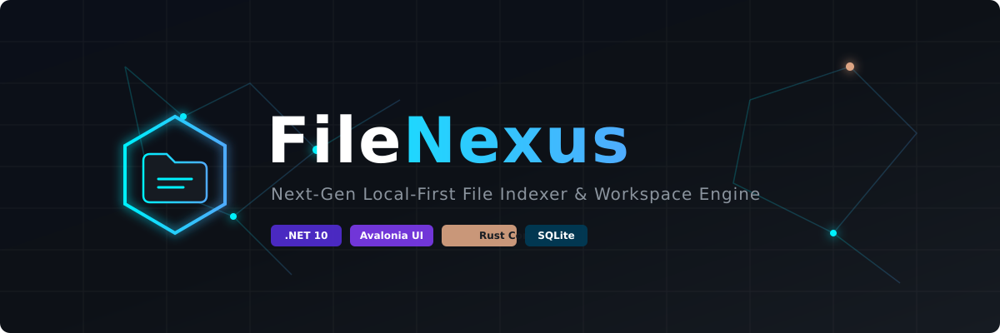

# FileNexus

<p align="center">
  
</p>

<p align="center">
  <strong>A high-performance, local-first, privacy-focused file indexing and management engine.</strong>
</p>

<p align="center">
  <a href="#vision">Vision</a> •
  <a href="#why-filenexus">Why FileNexus?</a> •
  <a href="#key-features">Key Features</a> •
  <a href="#technology-stack">Tech Stack</a> •
  <a href="#project-architecture">Architecture</a> •
  <a href="#getting-started">Getting Started</a> •
  <a href="#license">License</a>
</p>

---

## 🎯 Vision

**FileNexus** bridges the gap between blistering native performance and rich, intuitive desktop user experiences. Designed from the ground up for power users, developers, and data collectors, FileNexus combines a high-throughput **Rust indexing engine** with a modern **Avalonia UI** front-end on **.NET 10**.

Unlike traditional file indexers, FileNexus prioritizes absolute data privacy and zero cloud dependency. Every search, metadata extraction, and index operation happens locally on your machine, giving you instant access to your workspace without compromising your security.

---

## 💡 Why FileNexus?

* **⚡ Ultra-Fast File Scanning:** Powered by a low-level Rust core for maximum I/O performance and minimal CPU overhead.
* **🔒 Privacy-First & Local-First:** Your filesystem indices and metadata stay on your storage device. No external telemetry or cloud sync required.
* **🌐 True Cross-Platform:** Native rendering on both Windows and Linux using Avalonia UI and .NET 10.
* **🧩 Modular Plugin Architecture:** Extend file parsing, thumbnail generation, and metadata extraction using custom plugins.
* **🤖 AI-Ready Foundation:** Built with structured metadata schemas to seamlessly integrate local LLMs and semantic vector search in future updates.

---

## ✨ Key Features

* **Workspace-Based Indexing:** Define explicit root directories, exclude paths, and set dynamic indexing filters.
* **Category Explorer:** Effortlessly group files by types (Audio, Video, Code, Documents, Archives) dynamically.
* **Extension Explorer:** Drill down into your storage usage by file extensions with quick batch filtering.
* **Smart Local Search:** Instant fuzzy matching and property-based filtering across millions of file records.
* **Rich File Preview:** Inspect text, code, dynamic image previews, and structural metadata without opening third-party tools.
* **Real-Time Event Monitoring:** Reactive filesystem watcher hooks into OS-level events to keep indices immediately synchronized.

---

## 🛠 Technology Stack

| Component | Technology | Purpose |
| :--- | :--- | :--- |
| **User Interface** | [Avalonia UI](https://avaloniaui.net/) | Cross-platform XAML/C# desktop GUI |
| **Application Framework** | [.NET 10](https://dotnet.microsoft.com/) | High-performance runtime & desktop application logic |
| **Scanner Core** | [Rust](https://www.rust-lang.org/) | Multithreaded, high-speed filesystem traversing engine |
| **Interoperability** | FFI / Native Library Binding | Zero-copy bridge between C# runtime and Rust core |
| **Metadata Database** | [SQLite](https://www.sqlite.org/) | Lightweight, local relational database for indexed records |

---

## 🏗 Project Architecture

FileNexus relies on a multi-layer architectural pattern separating UI logic, dynamic business processing, and native low-level system operations:

```mermaid
graph TD
    A[Avalonia UI Front-End .NET 10] -->|Reactive Commands| B[Application / Core Logic C#]
    B -->|Metadata & Index Query| C[(SQLite Local DB)]
    B -->|C FFI / Native Calls| D[Rust Scanner Engine]
    D -->|Low-Level I/O & Parallel Traversal| E[OS File System]
    E -->|Real-Time FS Events| F[Event Monitoring System]
    F -->|Update Trigger| B
